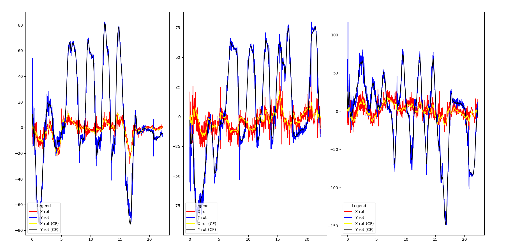

# Remote Robot Control

Данный репозиторий содержит исходные коды для программной части проекта 
19206 "Система дистанционного управления роботом".

## Complementary Filter

#### ax_2.py

В программе [ax_2.py](https://git.miem.hse.ru/19206/remote-robot-control/-/blob/master/ax_2.py)
производится получение данных с гироскопа и акселерометра датчика MPU6050 и их объединение 
с помощью комплементарного фильтра. Программа производит 1000 считываний,
сохраняет данные в .csv файл и выводит график, созданный в matplotlib.

#### mpudata2.py

В программе [mpudata2.py](https://git.miem.hse.ru/19206/remote-robot-control/-/blob/master/mpudata2.py)
данные получаются уже с двух датчиков. Программа производит 1000 считываний,
сохраняет данные в .csv файл и выводит график, созданный в matplotlib.

#### 3mpu.py

В программе [3mpu.py](https://git.miem.hse.ru/19206/remote-robot-control/-/blob/master/3mpu.py) 
данные получаются с двух датчиков и происходит расчет относительного поворота 
датчиков. Программа производит 1000 считываний,
сохраняет данные в .csv файл и выводит график, созданный в matplotlib.

**Полученный график**

#### mpu_mux.py

В программе [mpu_mux.py](https://git.miem.hse.ru/19206/remote-robot-control/-/blob/master/mpu_mux.py)
производится считывание данных с 4-х датчиков MPU6050, подключенных на I2C шину через 
I2C-мультиплексор Troyka Hub (чип PCA9547). Программа производит 1000 считываний и
выводит график, созданный в matplotlib. Возможен динамический вывод графика во время работы программы. 
Файлы .csv больше не создаются. 

#### mpu_mux1.py

В программе [mpu_mux1.py](https://git.miem.hse.ru/19206/remote-robot-control/-/blob/master/mpu_mux1.py) 
исправлено управление мультиплексором Troyka Hub. Программа производит считывание данных в бесконечном цикле 
и выводит 4 графика для данных с датчиков MPU6050.

#### mpu_xyz_cout.py

В программе [mpu_xyz_cout.py](https://git.miem.hse.ru/19206/remote-robot-control/-/blob/master/mpu_xyz_cout.py)
вывод данных о повороте одного датчика MPU6050 по осям XYZ, полученных с помощью 
комплементарного фильтра, выводится в терминал.

#### 4mpu_1mux_precalc.py

В программе [4mpu_1mux_precalc.py](https://git.miem.hse.ru/19206/remote-robot-control/-/blob/master/4mpu_1mux_precalc.py)
корректно выводятся 4 графика, отображающие повороты 4 датчиков MPU6050 по осям XYZ.
Датчики подключены через мультиплексор Troyka Hub.

#### RightArmCalc.py

Программа [RightArmCalc.py](https://git.miem.hse.ru/19206/remote-robot-control/-/blob/master/RightArmCalc.py)
выводит в терминал углы изгиба по осям XYZ для плеча, локтя и кисти. Данные получаются в бесконечном цикле с 4 датчиков
MPU6050 через мультиплексор Troyka Hub и обрабатываются комплементарным фильтром.

## DMP (Digital Motion Processor)

В папке [DMP](https://git.miem.hse.ru/19206/remote-robot-control/-/tree/master/DMP)
расположены модули программы, необходимые для использования встроенного производителем 
в датчик MPU6050/MPU9250 процессора для обработки данных.

#### mpu_dmp.py

В программе [mpu_dmp.py](https://git.miem.hse.ru/19206/remote-robot-control/-/blob/master/DMP/mpu_dmp.py)
осуществляется получение и вывод данных о повороте датчика. Данные представлены в кватернионах.
Есть возможность выводить данные, представленные в углах Эйлера. Это облегчает их восприятие.

#### mpu_dmp_2.py

В программе [mpu_dmp_2.py](https://git.miem.hse.ru/19206/remote-robot-control/-/blob/master/DMP2/mpu_dmp_2.py)
реализован расчет относительного кватерниона вращения между двумя датчиками. Данные выводятся в бесконечном цикле.

## Madgwick Filter

#### mpu_9250_madgwick.py

В программе [mpu_9250_madgwick.py](https://git.miem.hse.ru/19206/remote-robot-control/-/blob/master/SRCR%20MPU9250/mpu_9250_madgwick.py)
реализован фильтр Маджвика для обработки данных, получаемых с датчика MPU9250. 
На данный момент фильтр не настроен.

## Hand Motion Acquirement

#### sketch_feb07a_flex_sensor

Программа [sketch_feb07a_flex_sensor](https://git.miem.hse.ru/19206/remote-robot-control/-/tree/master/sketch_feb07a_flex_sensor),
написанная для Arduino, представляет собой тест для одного датчика изгиба. Данные выводятся на 16x2 LCD монитор.

#### sketch_feb22a_flex_glove_1

Программа [sketch_feb22a_flex_glove_1](https://git.miem.hse.ru/19206/remote-robot-control/-/tree/master/sketch_feb22a_flex_glove_1),
написанная для Arduino, считывает данные с 5 датчиков изгиба и преобразует их в углы. Данные выводятся на 16x2 LCD монитор.

#### ads1115_test.py

Программа [ads1115_test.py](https://git.miem.hse.ru/19206/remote-robot-control/-/blob/master/SRCR%20MPU9250/ads1115_test.py)
является тестом для АЦП ADS1115, выводит значение с нулевого канала и время его считывания.

#### ads1115_off_simptest_4_val.py

Программа [ads1115_off_simptest_4_val.py](https://git.miem.hse.ru/19206/remote-robot-control/-/blob/master/SRCR%20MPU9250/ads1115_off_simptest_4_val.py)
является тестом для АЦП ADS1115, выводит значения с 4-х каналов АЦП.

#### mux_cd.py

Программа [mux_cd.py](https://git.miem.hse.ru/19206/remote-robot-control/-/blob/master/mux_cd.py)
реализует управление аналоговым мультиплексором CD74HC4067.

## Interfacing with NAO

#### soc_with_nao.py

В программе [soc_with_nao.py](https://git.miem.hse.ru/19206/remote-robot-control/-/blob/master/test_socket/soc_with_nao.py)
реализован сокет для передачи данных на робота NAO.

#### almotion_poseInit.py

В программе [almotion_poseInit.py](https://git.miem.hse.ru/19206/remote-robot-control/-/blob/master/almotion_poseInit.py)
заданы движения для тестирования управления роботом NAO.
